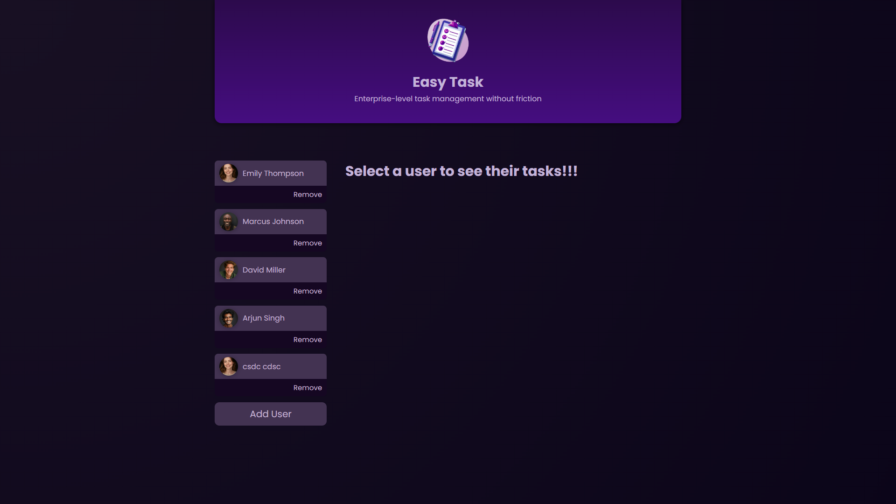

# 🧩 Task Management App

A sleek and intuitive **Task Management Web App** built with **Angular**, designed to help users **create, edit, and organize tasks** effortlessly — all stored securely in the browser’s **local storage**.

---

<div align="center">
  
</div>

---

## 🚀 Features

- ✅ **Add, Edit, and Delete Tasks** — Full CRUD functionality on the frontend.  
- 💾 **Local Storage Integration** — Tasks persist even after a page refresh.  
- 🧠 **Task Completion Toggle** — Mark tasks as done with instant visual feedback.  
- 🎨 **Clean & Responsive UI** — Styled with modern Angular components and SCSS.  
- ⚡ **Fast & Lightweight** — Runs entirely in the browser, no backend required.

---

## 🛠️ Tech Stack

| Layer | Technology |
|:------|:------------|
| **Frontend** | Angular, TypeScript, HTML, SCSS |
| **Storage** | Browser Local Storage |
| **Tools** | RxJS, Angular CLI |

---

## ⚙️ Installation & Setup

Follow these steps to run the project locally:

```bash
# Clone the repository
git clone https://github.com/Chiragmanral/Task-Management-App.git
cd Task-Management-App

# Install dependencies
npm install

# Run the development server
ng serve
